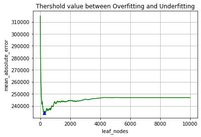

# Decision Tree Regressor Model and Random Forest Regressor Model

```python
import warnings 
warnings.filterwarnings("ignore") # Removing any warnings during execution
```


```python
import numpy as np
import pandas as pd
import matplotlib.pyplot as plt
```


```python
data = pd.read_csv('data/Melbourne_housing_FULL.csv')
```


```python
data = data.dropna(axis=0)
data.head()
```


<div>
<table border="1" class="dataframe">
  <thead>
    <tr style="text-align: right;">
      <th></th>
      <th>Suburb</th>
      <th>Address</th>
      <th>Rooms</th>
      <th>Type</th>
      <th>Price</th>
      <th>Method</th>
      <th>SellerG</th>
      <th>Date</th>
      <th>Distance</th>
      <th>Postcode</th>
      <th>...</th>
      <th>Bathroom</th>
      <th>Car</th>
      <th>Landsize</th>
      <th>BuildingArea</th>
      <th>YearBuilt</th>
      <th>CouncilArea</th>
      <th>Lattitude</th>
      <th>Longtitude</th>
      <th>Regionname</th>
      <th>Propertycount</th>
    </tr>
  </thead>
  <tbody>
    <tr>
      <td>2</td>
      <td>Abbotsford</td>
      <td>25 Bloomburg St</td>
      <td>2</td>
      <td>h</td>
      <td>1035000.0</td>
      <td>S</td>
      <td>Biggin</td>
      <td>4/02/2016</td>
      <td>2.5</td>
      <td>3067.0</td>
      <td>...</td>
      <td>1.0</td>
      <td>0.0</td>
      <td>156.0</td>
      <td>79.0</td>
      <td>1900.0</td>
      <td>Yarra City Council</td>
      <td>-37.8079</td>
      <td>144.9934</td>
      <td>Northern Metropolitan</td>
      <td>4019.0</td>
    </tr>
    <tr>
      <td>4</td>
      <td>Abbotsford</td>
      <td>5 Charles St</td>
      <td>3</td>
      <td>h</td>
      <td>1465000.0</td>
      <td>SP</td>
      <td>Biggin</td>
      <td>4/03/2017</td>
      <td>2.5</td>
      <td>3067.0</td>
      <td>...</td>
      <td>2.0</td>
      <td>0.0</td>
      <td>134.0</td>
      <td>150.0</td>
      <td>1900.0</td>
      <td>Yarra City Council</td>
      <td>-37.8093</td>
      <td>144.9944</td>
      <td>Northern Metropolitan</td>
      <td>4019.0</td>
    </tr>
    <tr>
      <td>6</td>
      <td>Abbotsford</td>
      <td>55a Park St</td>
      <td>4</td>
      <td>h</td>
      <td>1600000.0</td>
      <td>VB</td>
      <td>Nelson</td>
      <td>4/06/2016</td>
      <td>2.5</td>
      <td>3067.0</td>
      <td>...</td>
      <td>1.0</td>
      <td>2.0</td>
      <td>120.0</td>
      <td>142.0</td>
      <td>2014.0</td>
      <td>Yarra City Council</td>
      <td>-37.8072</td>
      <td>144.9941</td>
      <td>Northern Metropolitan</td>
      <td>4019.0</td>
    </tr>
    <tr>
      <td>11</td>
      <td>Abbotsford</td>
      <td>124 Yarra St</td>
      <td>3</td>
      <td>h</td>
      <td>1876000.0</td>
      <td>S</td>
      <td>Nelson</td>
      <td>7/05/2016</td>
      <td>2.5</td>
      <td>3067.0</td>
      <td>...</td>
      <td>2.0</td>
      <td>0.0</td>
      <td>245.0</td>
      <td>210.0</td>
      <td>1910.0</td>
      <td>Yarra City Council</td>
      <td>-37.8024</td>
      <td>144.9993</td>
      <td>Northern Metropolitan</td>
      <td>4019.0</td>
    </tr>
    <tr>
      <td>14</td>
      <td>Abbotsford</td>
      <td>98 Charles St</td>
      <td>2</td>
      <td>h</td>
      <td>1636000.0</td>
      <td>S</td>
      <td>Nelson</td>
      <td>8/10/2016</td>
      <td>2.5</td>
      <td>3067.0</td>
      <td>...</td>
      <td>1.0</td>
      <td>2.0</td>
      <td>256.0</td>
      <td>107.0</td>
      <td>1890.0</td>
      <td>Yarra City Council</td>
      <td>-37.8060</td>
      <td>144.9954</td>
      <td>Northern Metropolitan</td>
      <td>4019.0</td>
    </tr>
  </tbody>
</table>
<p>5 rows × 21 columns</p>
</div>

```python
model_parameters=['Rooms', 'Bathroom', 'Landsize', 'Lattitude', 'Longtitude','YearBuilt','BuildingArea','Landsize','Propertycount']
X = data[model_parameters]
y = data.Price
X.head(10)
```

<div>
<table border="1" class="dataframe">
  <thead>
    <tr style="text-align: right;">
      <th></th>
      <th>Rooms</th>
      <th>Bathroom</th>
      <th>Landsize</th>
      <th>Lattitude</th>
      <th>Longtitude</th>
      <th>YearBuilt</th>
      <th>BuildingArea</th>
      <th>Landsize</th>
      <th>Propertycount</th>
    </tr>
  </thead>
  <tbody>
    <tr>
      <td>2</td>
      <td>2</td>
      <td>1.0</td>
      <td>156.0</td>
      <td>-37.8079</td>
      <td>144.9934</td>
      <td>1900.0</td>
      <td>79.0</td>
      <td>156.0</td>
      <td>4019.0</td>
    </tr>
    <tr>
      <td>4</td>
      <td>3</td>
      <td>2.0</td>
      <td>134.0</td>
      <td>-37.8093</td>
      <td>144.9944</td>
      <td>1900.0</td>
      <td>150.0</td>
      <td>134.0</td>
      <td>4019.0</td>
    </tr>
    <tr>
      <td>6</td>
      <td>4</td>
      <td>1.0</td>
      <td>120.0</td>
      <td>-37.8072</td>
      <td>144.9941</td>
      <td>2014.0</td>
      <td>142.0</td>
      <td>120.0</td>
      <td>4019.0</td>
    </tr>
    <tr>
      <td>11</td>
      <td>3</td>
      <td>2.0</td>
      <td>245.0</td>
      <td>-37.8024</td>
      <td>144.9993</td>
      <td>1910.0</td>
      <td>210.0</td>
      <td>245.0</td>
      <td>4019.0</td>
    </tr>
    <tr>
      <td>14</td>
      <td>2</td>
      <td>1.0</td>
      <td>256.0</td>
      <td>-37.8060</td>
      <td>144.9954</td>
      <td>1890.0</td>
      <td>107.0</td>
      <td>256.0</td>
      <td>4019.0</td>
    </tr>
    <tr>
      <td>18</td>
      <td>2</td>
      <td>1.0</td>
      <td>220.0</td>
      <td>-37.8010</td>
      <td>144.9989</td>
      <td>1900.0</td>
      <td>75.0</td>
      <td>220.0</td>
      <td>4019.0</td>
    </tr>
    <tr>
      <td>24</td>
      <td>3</td>
      <td>2.0</td>
      <td>214.0</td>
      <td>-37.8085</td>
      <td>144.9964</td>
      <td>2005.0</td>
      <td>190.0</td>
      <td>214.0</td>
      <td>4019.0</td>
    </tr>
    <tr>
      <td>25</td>
      <td>2</td>
      <td>2.0</td>
      <td>0.0</td>
      <td>-37.8078</td>
      <td>144.9965</td>
      <td>2009.0</td>
      <td>94.0</td>
      <td>0.0</td>
      <td>4019.0</td>
    </tr>
    <tr>
      <td>30</td>
      <td>2</td>
      <td>1.0</td>
      <td>238.0</td>
      <td>-37.8090</td>
      <td>144.9976</td>
      <td>1890.0</td>
      <td>97.0</td>
      <td>238.0</td>
      <td>4019.0</td>
    </tr>
    <tr>
      <td>32</td>
      <td>3</td>
      <td>2.0</td>
      <td>113.0</td>
      <td>-37.8056</td>
      <td>144.9930</td>
      <td>1880.0</td>
      <td>110.0</td>
      <td>113.0</td>
      <td>4019.0</td>
    </tr>
  </tbody>
</table>
</div>


### DecisionTreeRegression Model


```python
from sklearn.model_selection import train_test_split
from sklearn.metrics import mean_absolute_error
from sklearn.tree import DecisionTreeRegressor
```


```python
# values = []
# while True:
#     train_X,val_X,train_y,val_y = train_test_split(X,y,random_state=1)
#     melbourne_model = DecisionTreeRegressor()
#     melbourne_model.fit(train_X,train_y)
#     predicted_values = melbourne_model.predict(val_X)
#     error = mean_absolute_error(val_y,predicted_values)
#     if error<240811.7916291629:
#         break
#     values.append(error)
train_X,val_X,train_y,val_y = train_test_split(X,y,random_state=1)
melbourne_model = DecisionTreeRegressor()
melbourne_model.fit(train_X,train_y)
predicted_values = melbourne_model.predict(val_X)
error = mean_absolute_error(val_y,predicted_values)
error
```


    247591.82763276328


**Finding a Sweet Spot Between Underfitting and Overfitting**


```python
def get_mean_square_error(max_leaf_node,train_X,val_X,train_y,val_y):
    model_selection = DecisionTreeRegressor(max_leaf_nodes=max_leaf_node,random_state = 0)
    model_selection.fit(train_X,train_y)
    prediction = model_selection.predict(val_X)
    error = mean_absolute_error(val_y,prediction)
    return(error)
```


```python
leaf= []
error = []
for i in range(10,10000,10):
    msr_error = get_mean_square_error(i,train_X,val_X,train_y,val_y)
    leaf.append(i)
    error.append(msr_error)
```


```python
plt.plot(leaf,error,'g',leaf[error.index(min(error))],min(error),'b^')
plt.title('Thershold value between Overfitting and Underfitting')
plt.xlabel('leaf_nodes')
plt.ylabel('mean_absolute_error')
plt.grid(min(error))
```





```python
p_leaf = leaf[error.index(min(error))]
print("The Sweet Spot is at: \nleaf : %d \nMeanAverageError: %d"%(leaf[error.index(min(error))],min(error)))
```

    The Sweet Spot is at: 
    leaf : 260 
    MeanAverageError: 234117
    

**Perfect leaf value for Perdection**


```python
model_selection = DecisionTreeRegressor(max_leaf_nodes=p_leaf,random_state = 0)
model_selection.fit(train_X,train_y)
model_selection.predict(val_X)
```


    array([ 579536.3877551 ,  594885.13071895, 2602133.33333333, ...,
           2165300.        ,  718292.5974026 , 1416507.95454545])


## Random Forest Regressor Model


```python
from sklearn.ensemble import RandomForestRegressor
```


```python
model_selection_r = RandomForestRegressor(n_estimators=100,random_state = 1)
model_selection_r.fit(train_X,train_y)
predection_r = model_selection_r.predict(val_X)
mean_absolute_error(val_y,predection_r)
```


    178858.92486884404


```python

```
